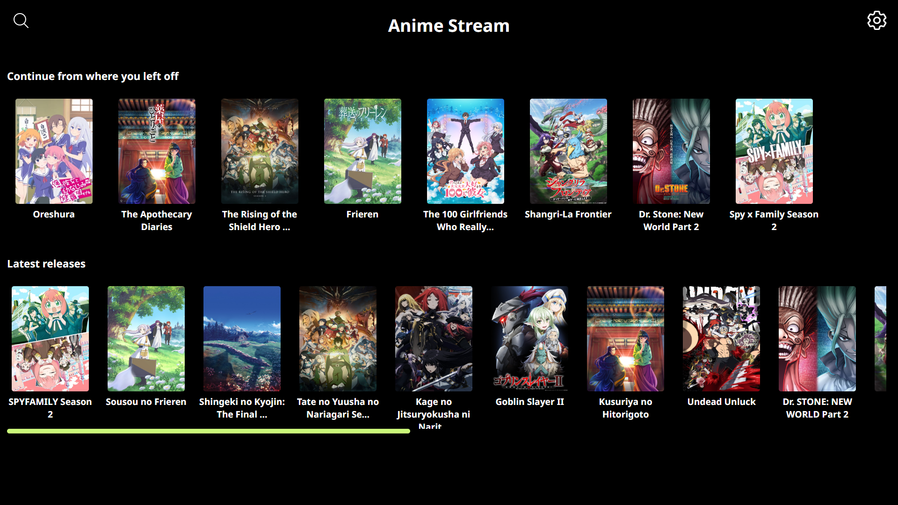
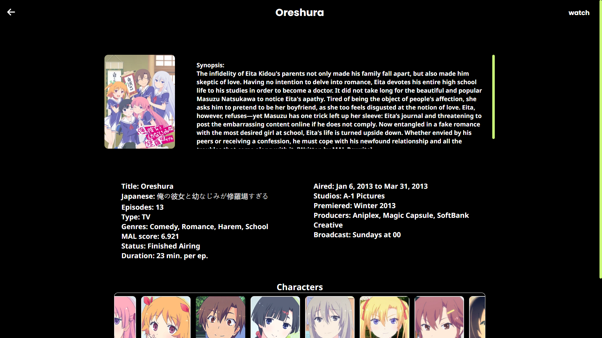
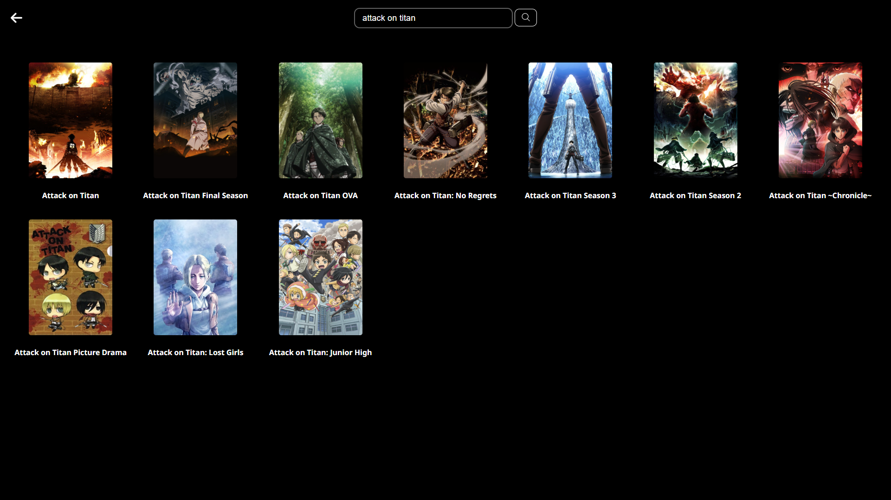

# Anime Stream Project

Welcome to the Anime Stream project—a simple project designed for streaming and downloading your favorite anime!


*(Note: Logo redesign in progress)*

## Tech Stack

Built with ❤️ using TypeScript


## Introduction

This project is made to just test my skills (im still kind of new). While this is a work in progress, I'm excited to share my journey with you. Expect some hiccups along the way—I'm still learning! Making this app has taught me many things(mainly to cope with depression and rage). I will be making updates and fixing issues and bugs in my free time!

## Screenshots Showcase







## Available Sources

Currently, you can enjoy anime content from the following sources:

- **Gogo**
- **Animepahe**

## Known Issues

Ofcourse there are issues(a lot) some of the major stuffs are:

- **Subsplease Server Error:** Subsplease server is currently giving a 403 error. I'm actively working on resolving this issue.

- **Episode Selection Glitch:** Occasionally, the wrong anime gets selected when choosing an episode. This issue will be fixed soon!.

*Pro Tip: Dont use MAL as database(It doesnt work well with my concept).*

## Commands

To run the program, use the following command:

```bash
npm run test
```

To make the setup executable file, use the following command:

```
npm run make
```
The setup file will be situated in the out folder in the project root after using the make command.

## License

This project is licensed under the **GNU Affero Public License version 3.0**.